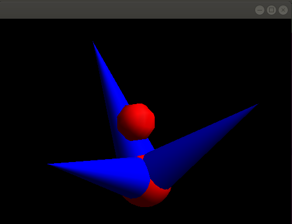

# multiPick
[Nigel Stewart](http://www.nigels.com/glt/gltzpr/)'s ZPR interface: plus object picking example for linux. Have used on mac and windows before; this version is Ubuntu / linux oriented

Note to self: should update this with the "moveAtom" feature
